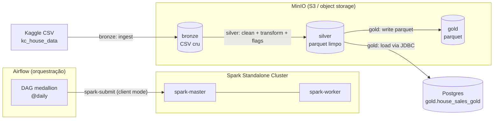

# House Sales — Pipeline ETL Batch (Home Lab de Dados)

Este projeto é um home lab de dados: uma infraestrutura local, 100% conteinerizada, montada do zero na própria máquina para rodar um pipeline ETL em modo batch sobre a arquitetura medallion (bronze → silver → gold).

Em vez de usar serviços gerenciados de nuvem, toda a stack sobe e é orquestrada localmente com Docker Compose — cada ferramenta roda em seu próprio container, comunicando-se em rede como num ambiente de produção real. O objetivo é dominar, ponta a ponta, como as peças de um data lake se conectam: orquestração, storage, processamento distribuído e serving.

> **Dataset:** [House Sales in King County, USA](https://www.kaggle.com/datasets/harlfoxem/housesalesprediction) (Kaggle) — um arquivo CSV único de vendas de imóveis.

---

## A ideia

Montar um home lab que simula um data lake real, sem nenhuma dependência de nuvem — tudo roda na máquina local via containers.

- **Infraestrutura local conteinerizada** — todos os serviços (orquestrador, cluster de processamento, object storage, bancos, broker) sobem juntos com um `docker compose up`, cada um em seu container.
- **ETL batch** — processa um arquivo estático do Kaggle sob agendamento (não é streaming): ingere, analisa, valida e filtra os dados, aplica regras de negócio e serve o resultado.
- **Stack distribuída de mercado** — Airflow orquestra, Spark processa em cluster, MinIO guarda os dados como object storage compatível com S3, Postgres serve a camada final, Redis atua como broker do Celery.

### Serviços que compõem o home lab

A infraestrutura é formada pelos seguintes serviços, cada um isolado em seu container e integrado via Docker Compose:

| Serviço | Função no home lab |
|---|---|
| **Apache Airflow** | Orquestração das DAGs (CeleryExecutor + Celery worker + scheduler + triggerer) |
| **Apache Spark** (master + worker) | Cluster de processamento distribuído (camadas silver e gold) |
| **MinIO** | Object storage compatível com S3 — o "data lake" (buckets bronze/silver) |
| **PostgreSQL** (×2) | Um para metadados do Airflow, outro como serving da camada gold |
| **Redis** | Broker de mensagens do Celery |
| **Jupyter** | Ambiente de exploração e prototipação das transformações |

---

## Arquitetura



### Serviços (containers)

| Serviço | Imagem base | Papel | Porta(s) |
|---|---|---|---|
| `airflow-*` | `apache/airflow:3.2.2` | Orquestração (CeleryExecutor) | 8080 (UI) |
| `spark-master` / `spark-worker` | `apache/spark:4.0.3` | Cluster de processamento | 7077, 8090 (UI) |
| `minio` | `quay.io/minio/minio` | Object storage (s3a) | 9000 (API), 9001 (console) |
| `postgres_storage` | `postgres:16` | Serving / camada gold | 5432 |
| `postgres_airflow` | `postgres:16` | Metadados do Airflow | — |
| `redis` | `redis:7.2` | Broker do Celery | — |
| `jupyter` | `jupyter/base-notebook` | Exploração / prototipação | 8888 |

---

## Camadas Medallion

| Camada | O que faz | Tecnologia | Destino |
|---|---|---|---|
| **Bronze** | Baixa o CSV do Kaggle e ingere cru, fiel à fonte | Python + MinIO client | `s3a://bronze/` |
| **Silver** | Limpa, valida e transforma: normaliza nulos/espaços, conserta `price`/`date`/`long`/`floors`, casts de tipos, regras de negócio (ano construção × renovação), e cria flags (`idade_imovel`, `foi_renovado`, `tem_porao`, `classificacao_tamanho_imovel`) | PySpark | `s3a://silver/` (parquet) |
| **Gold** | Lê o silver e disponibiliza os dados prontos para consumo analítico/BI em dois destinos: carrega na tabela relacional (serving SQL) e grava em parquet no data lake | PySpark + JDBC | `gold.house_sales_gold` (Postgres) + `s3a://gold/` (parquet) |

---

## Destaque técnico: Spark em *client mode* via Airflow

O processamento Spark é disparado pelo Airflow usando o `SparkSubmitOperator`, em client mode:

- O **driver** roda dentro do container do Airflow (que faz o `spark-submit`).
- Os **executors** rodam no cluster Spark (`spark-master` / `spark-worker`).
- Por ser client mode, o driver é o próprio worker do Airflow, o que mantém logs e ciclo de vida da task integrados à UI do Airflow.

Os conectores externos (que não vêm na distribuição do Spark) são adicionados via pasta `jars/` e embutidos nas imagens:

- `hadoop-aws` + AWS SDK `bundle` → conector s3a para falar com o MinIO
- `postgresql` JDBC → escrita na camada gold no Postgres

---

## Como rodar

**Pré-requisitos:** Docker + Docker Compose. Além disso, dois artefatos binários não versionados no git (ficam de fora por tamanho) precisam ser baixados antes do build: o arquivo tar do Spark (em `downloads/`) e os jars de conectores (em `jars/`).

```bash
# 1. Configurar variáveis de ambiente
cp .env.example .env       # depois edite o .env com suas credenciais (Kaggle, senhas, Fernet key)

# 2. Criar as pastas usadas como volumes (bind mounts)
#    Não vêm no clone: são ignoradas pelo git ou diretórios vazios que o git não versiona.
mkdir -p logs plugins config minio/data data

# 3. Baixar o Spark 4.0.3 (usado no build da imagem do Airflow)
mkdir -p downloads
curl -fL -o downloads/spark-4.0.3-bin-hadoop3.tgz \
  https://archive.apache.org/dist/spark/spark-4.0.3/spark-4.0.3-bin-hadoop3.tgz

# 4. Baixar os jars de conectores do Spark (s3a + JDBC)
mkdir -p jars
# Conector s3a (MinIO):
curl -fL -o jars/hadoop-aws-3.4.1.jar \
  https://repo1.maven.org/maven2/org/apache/hadoop/hadoop-aws/3.4.1/hadoop-aws-3.4.1.jar
# AWS SDK v2 bundle (dependência do hadoop-aws):
curl -fL -o jars/bundle-2.24.6.jar \
  https://repo1.maven.org/maven2/software/amazon/awssdk/bundle/2.24.6/bundle-2.24.6.jar
# Driver JDBC do Postgres (camada gold):
curl -fL -o jars/postgresql-42.7.11.jar \
  https://repo1.maven.org/maven2/org/postgresql/postgresql/42.7.11/postgresql-42.7.11.jar

# 5. Subir a stack
docker compose -f ./docker/docker-homelab-compose.yml --env-file ./.env up -d --build
```

> Os jars precisam vir antes do build porque os Dockerfiles fazem `COPY jars/` para o classpath do Spark. As versões devem casar com o cluster (Spark 4.0.3 / Hadoop 3).

> **Pastas de volume (passo 2):** o compose monta `logs/`, `plugins/`, `config/`, `minio/data/` e `data/` como bind mounts. Elas não vêm no repositório, seja porque estão no `.gitignore` (`logs`, `minio/data` e os binários), seja porque são diretórios vazios que o git não versiona (`plugins/`, `config/`). Sem criá-las antes, o `docker compose up` falha ao montar os volumes. O `airflow.cfg` dentro de `config/` é gerado automaticamente pelo serviço `airflow-init`.

**Acessos:**

| UI | URL |
|---|---|
| Airflow | http://localhost:8080 |
| Spark Master | http://localhost:8090 |
| MinIO Console | http://localhost:9001 |
| Jupyter | http://localhost:8888 |

### Connection do Spark no Airflow

As DAGs disparam o `SparkSubmitOperator` usando a connection apontada por `SPARK_MASTER_CONN_ID` (default: `spark_master`). Essa connection não é criada automaticamente — depois de subir a stack, crie-a na UI do Airflow em **Admin → Connections → +**:

| Campo | Valor |
|---|---|
| Connection Id | `spark_master` (precisa bater com `SPARK_MASTER_CONN_ID` do `.env`) |
| Connection Type | `Spark` |
| Host | `spark://spark-master` |
| Port | `7077` |

> A connection `postgres_default` (usada pelo `SQLExecuteQueryOperator` da camada gold) já é criada automaticamente via `AIRFLOW_CONN_POSTGRES_DEFAULT` no compose — não precisa fazer nada.

**Alternativa sem clicar na UI:** declare a connection como env var no serviço Airflow do compose (mesmo padrão do postgres), e ela é criada no boot:
>
> ```yaml
> AIRFLOW_CONN_SPARK_MASTER: 'spark://spark-master:7077'
> ```

Depois de subir, despause a DAG `medallion` na UI do Airflow para iniciar a execução diária. As DAGs `bronze`, `silver` e `gold` existem separadas para execução manual/reprocessamento.

> Agendamento: a `medallion` roda `@daily` com `catchup=False` (sem backfill de dias anteriores).

---

## Estrutura

```
.
├── dags/                # DAGs do Airflow (bronze, silver, gold, medallion)
│   └── sql/             # DDL da tabela gold
├── jobs/                # Jobs de processamento (bronze.py, silver.py, gold.py)
├── docker/              # Dockerfiles (airflow/spark/jupyter) + compose
├── notebooks/           # Exploração em Jupyter
├── config/              # Config do Airflow (airflow.cfg gerado no boot)
├── .env.example         # Template de variáveis de ambiente
│
│   # criados no setup (passo 2): fora do git, montados como volumes
├── jars/                # Conectores Spark (s3a, JDBC), baixados no setup
├── downloads/           # Tarball do Spark, baixado no setup
├── logs/                # Logs do Airflow (volume)
├── plugins/             # Plugins do Airflow (volume)
├── minio/data/          # Dados do MinIO / object storage (volume)
└── data/                # Dados locais montados no Jupyter (volume)
```

---

## Stack

`Apache Airflow 3.2` · `Apache Spark 4.0` · `MinIO` · `PostgreSQL 16` · `Redis` · `Docker Compose` · `Python` · `PySpark` · `Jupyter`
